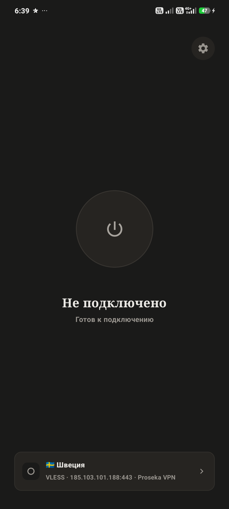

# Karst VPN (Android)

<p align="center">
  
  
  
</p>

Karst — приложение для подключения к VLESS-серверам и подпискам на Android. Добавляешь ссылку/подписку, выбираешь сервер из списка и подключаешься. Подписки обновляются автоматически, есть проверка задержки серверов и три режима маршрутизации. Тёмная и светлая тема, при первом запуске подстраивается под системную, далее можно изменить в настройках.

Также есть [десктопная версия](https://github.com/elev1e1nSure/karst-vpn-desktop) и [лендинг](https://github.com/elev1e1nSure/karst-site).

<p align="center">
  
</p>

## Установка

APK-файлы доступны в [Releases](https://github.com/elev1e1nSure/karst-vpn/releases) — скачать последнюю версию и установить вручную.

## Разработка

Требуется Android SDK и JDK. Сборка через PowerShell:

```powershell
.\gradlew.bat assembleDebug     # отладочная сборка
.\gradlew.bat test              # тесты
.\gradlew.bat assembleRelease   # релизная сборка
```

Либо через `just`: `just dbg`, `just rel`, `just test`, `just clean`, `just all`.

Для сборки libbox.aar из sing-box: `.\scripts\build_libbox.ps1`.

Подробнее об архитектуре — в [CLAUDE.md](./CLAUDE.md).

## Сборка релиза

Push тега `v*` запускает GitHub Actions, которая собирает APK и публикует его в Releases (см. `.github/workflows/release.yml`).
